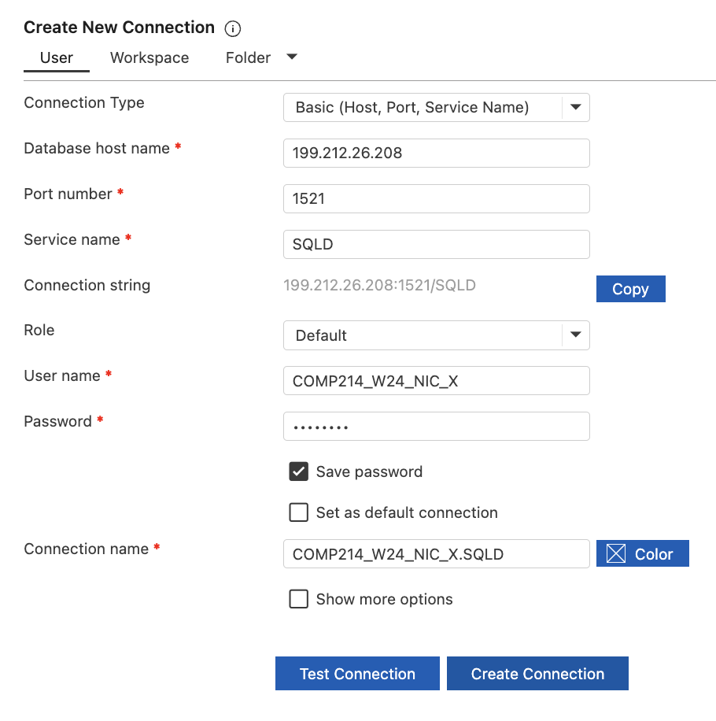

# Connecting to Oracle DB and Resetting Password

- Username: COMP214_W24_nic_x
- password: password
- Hostname on campus: oracle1.centennialcollege.ca
- Hostname for off campus connection: 199.212.26.208
- port: 1521
- SID: SQLD

We use Oracle SQL Developer as the UL to Oracle
(https://www.oracle.com/tools/downloads/sqldev-downloads.html)

Steps to Resetting Oracle Login Password

- Step 1 - Right-click on the connection
- Step 2 - Select the “Reset Password” option from the menu
- In the dialog, enter the current password and the new password confirmation
- Click the OK button

